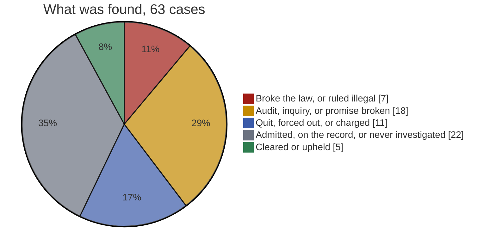
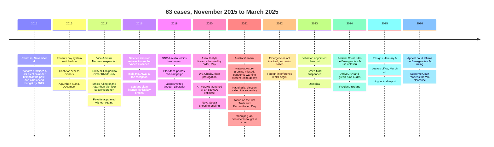
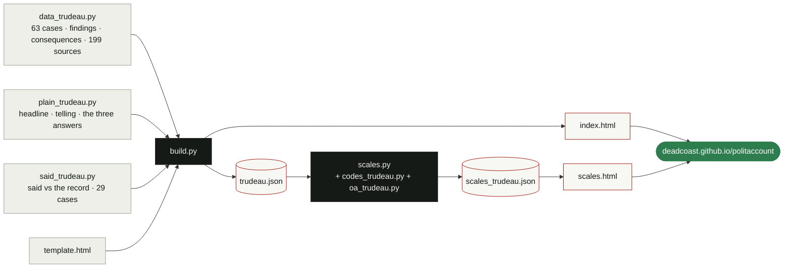

<div align="center">

<h1>P O L I T A C C O U N T</h1>

<p><em>Accountability through History.</em></p>

<p>
<a href="https://deadcoast.github.io/politaccount/"></a>
</p>

<p>


</p>

<p>


<a href="https://github.com/deadcoast/politaccount/commits"></a>
</p>

<p>
<a href="#tally">Tally</a> &nbsp;·&nbsp;
<a href="#two-scales">Two scales</a> &nbsp;·&nbsp;
<a href="#large-cases">Large cases</a> &nbsp;·&nbsp;
<a href="#what-a-case-looks-like">What a case looks like</a> &nbsp;·&nbsp;
<a href="#nine-years">Nine years</a> &nbsp;·&nbsp;
<a href="#all-63-cases">All 63 cases</a> &nbsp;·&nbsp;
<a href="#how-its-built">How it’s built</a> &nbsp;·&nbsp;
<a href="#the-data">The data</a> &nbsp;·&nbsp;
<a href="#the-rules">The rules</a>
</p>

</div>

<br>

Politaccount is a record of what Canadian leaders did in office, written so that anyone can read it. Each case answers three questions in plain words: **what they found**, **what it cost you**, **what happened to him**. Under every case sits the evidence: the deciding body’s own words, the dates, and the sources, official documents first.

**Record 001 is Justin Trudeau**, Prime Minister from November 4, 2015 to March 14, 2025. 3,418 days, three elections, 63 cases.

> [!IMPORTANT]
> The ethics commissioner ruled **twice** that he broke the law. **Two courts** ruled his use of the Emergencies Act was illegal. **Six** audits found money wasted, rules ignored, or the country unprepared. Fines, sanctions or charges he ever faced: **0**.

---

## Tally

<table align="center">
<tr>
<td align="center" width="34%"><h1>0</h1><b>Fines, sanctions or charges he faced</b><br><sub>The ethics law has no penalty for what he did. Nobody imposed one.</sub></td>
<td align="center" width="22%"><h1>2</h1><b>Times he broke the ethics law</b><br><sub>Aga Khan 2017 · SNC-Lavalin 2019</sub></td>
<td align="center" width="22%"><h1>1</h1><b>Action ruled illegal by the courts</b><br><sub>Emergencies Act · 2024, upheld 2026</sub></td>
<td align="center" width="22%"><h1>6</h1><b>Audits: money wasted or rules ignored</b><br><sub>Phoenix · COVID benefits · ArriveCAN · McKinsey · green fund · pandemic readiness</sub></td>
</tr>
<tr>
<td align="center"><h1>4</h1><b>Ethics-law breaches by his ministers</b><br><sub>Morneau ×2 · LeBlanc · Ng · total fines: $200</sub></td>
<td align="center"><h1>8</h1><b>Ministers who quit or were pushed out</b></td>
<td align="center"><h1>9</h1><b>Official inquiries into his government</b></td>
<td align="center"><h1>7</h1><b>Allegations nobody investigated</b><br><sub>Kept, and labelled that way</sub></td>
</tr>
</table>

Counted from the 63 cases, by what was found:

```text
Broke the law · ruled illegal                 ████████░░░░░░░░░░░░░░░░   7
Audit · inquiry · promise broken              ████████████████████░░░░  18
Quit · forced out · charged                   ████████████░░░░░░░░░░░░  11
Admitted · on the record · never investigated ████████████████████████  22
Cleared · upheld                              █████░░░░░░░░░░░░░░░░░░░   5
```



---

## Two scales

Every leader is scored on the same two scales, with rules fixed before anyone was scored. Conduct, never policy. Every point traces to a case, a date and a source. The method is in [`SCALES.md`](SCALES.md); the page is [`scales.html`](https://deadcoast.github.io/politaccount/scales.html).

<table align="center">
<tr>
<td align="center" width="50%"><sub>OPERATIONAL ACCOUNTABILITY</sub><h1>18.7<sub> / 100</sub></h1><b>Unaccountable</b><br><sub>Fought or ignored the findings. Nothing landed on him. The same conduct again.</sub></td>
<td align="center" width="50%"><sub>PROVABLE OBSERVABLE CORRUPTION</sub><h1>90.7<sub> points</sub></h1><b>Systemic</b><br><sub>A pattern, plus obstruction of scrutiny and false statements to the public both proven, plus a repeat after an adverse finding.</sub></td>
</tr>
</table>

**Accountability** is counted, not graded. In the 41 cases where a body found against him, his government or a minister, or they admitted the fault: a consequence landed on him personally in **0**, on a minister or official in 17, on no one in 24. He fought 18, said nothing in 12, owned 11 before a ruling. 8 changed in office; the same conduct recurred after 8. Words count for nothing; nothing after the last day in office counts.

**Corruption** is an elements test in plain words, graded by evidence. 26 proven acts across 21 cases, 13 of them adjudicated; 9.7 points a year in office. The band is five yes-or-no tests on the ledger, every one of them met.

---

## Large cases

The fourteen that matter most, in the order the page gives them. Costs are the public bill on the record; blank means none was ever put on the record.

| Label | Case | What it cost you | What happened to him |
|:--|:--|--:|:--|
| <kbd>Broke the ethics law</kbd> | Took a free holiday on a billionaire's private island while the billionaire's foundation lobbied his office. Broke the ethics law. Paid nothing. | $215,398 | Nothing. |
| <kbd>Broke the ethics law</kbd> | Leaned on his attorney general to spare SNC-Lavalin a criminal trial. Broke the ethics law. Two ministers who wouldn't go along were pushed out. | — | Nothing. |
| <kbd>Court: illegal, upheld on appeal</kbd> | Invoked the Emergencies Act against the convoy protests and froze people's bank accounts. Two courts have ruled it was illegal. Nobody paid for it. | — | Nothing. |
| <kbd>Cleared, now under court review</kbd> | Handed a $912-million student program to a charity that had paid his mother and brother over $280,000 in speaking fees. Didn't recuse. Cleared, and now the courts get to check that. | — | Nothing. |
| <kbd>Audit: rules ignored</kbd> | An app first estimated at $80,000 ended up costing about $60 million. A two-man firm got $19 million. Nobody has been charged. | $59.5 million | Nothing. |
| <kbd>Audit: conflicts, ineligible grants</kbd> | The government's billion-dollar green-tech fund gave $59 million to ineligible projects and $76 million in deals where board members had conflicts. Parliament seized up for four months over the documents. | $123 million | Nothing. |
| <kbd>Inquiry: slow, not transparent</kbd> | Warned by CSIS about Chinese interference in two elections, his government was 'slow to act' and 'insufficiently transparent', in a public inquiry's words. | — | Nothing. |
| <kbd>Vance pleaded guilty</kbd> | Told in 2018 that the top general faced a misconduct allegation, his defence minister refused to look at the evidence. The general stayed three more years. | — | Nothing. |
| <kbd>Case collapsed</kbd> | His government prosecuted a vice-admiral for leaking, after Trudeau twice predicted the case would go to court before any charge existed. The case collapsed. | $500,000 | Nothing. |
| <kbd>Audit: $4.6B overpaid</kbd> | $4.6 billion in pandemic benefits went to people who weren't eligible, and $27 billion more needs checking. The tax agency said checking wasn't worth it. | $4.6 billion | Nothing. |
| <kbd>Audit: failure</kbd> | Switched on a pay system that failed hundreds of thousands of public servants. The fix has cost $5 billion. | $5.1 billion | Nothing. |
| <kbd>Admitted</kbd> | Wore blackface at least three times. Couldn't say how many. | — | Two apologies. |
| <kbd>Promise broken</kbd> | Promised to end every long-term boil-water advisory on reserves within five years. The deadline passed with 58 still in place. | — | Nothing. |
| <kbd>Audit: unprepared</kbd> | The pandemic early-warning system stayed silent, the risk was rated 'low' until March 12, 2020, and two-thirds of quarantined travellers were never checked. | — | Nothing. |

---

## What a case looks like

Every case on the page has the same shape. Here is one, exactly as the data renders it.

<kbd>Broke the ethics law</kbd> &nbsp; <sub>Trudeau himself · 2016–2017</sub>

### Took a free holiday on a billionaire's private island while the billionaire's foundation lobbied his office. Broke the ethics law. Paid nothing.

Over Christmas 2016 he, his family and friends stayed on the Aga Khan's private island in the Bahamas, flying in on the Aga Khan's helicopter. At the time the Aga Khan's foundation was registered to lobby the Prime Minister's Office and had a $15-million federal grant in the pipeline. The ethics commissioner ruled he broke four sections of the Conflict of Interest Act, the first prime minister ever found to have broken it. Security for the trip cost taxpayers $215,000. The RCMP looked at a fraud charge and dropped it in 2019, partly because it couldn't tell whether a prime minister can legally give himself permission to accept a gift.

| What they found | What it cost you | What happened to him |
|:--|:--|:--|
| Ethics commissioner: broke four sections of the Conflict of Interest Act. RCMP: considered a fraud charge, closed the file. | $215,398 in security and travel. | **Nothing.** The sections he broke carry no penalty. He said he accepted the report. |

**Said, against the record**

```diff
- 2017-01-10 · Trudeau: “The Aga Khan has been a long-time family friend. He was a pallbearer for my
- father’s funeral. He has known me since I was a toddler. And this was our family vacation.”
+ The record: The ethics commissioner found there had been no private interactions between the two men
+ until Trudeau became Liberal leader, and that “their relationship cannot be described as one of friends
+ for the purposes of the Act.” The friendship exception failed; four sections of the law were broken.
```

<sub>Sources for this case</sub> [^1][^2][^3][^4][^5]

<details>
<summary>What sits under “Show the evidence”</summary>
<br>

> I found that Mr. Trudeau contravened sections 5, 11, 12 and 21 of the Act. […] The vacations accepted by Mr. Trudeau or his family might reasonably be seen to have been given to influence Mr. Trudeau. […] There were no private interactions between Mr. Trudeau and the Aga Khan until Mr. Trudeau became Leader of the Liberal Party of Canada. This led me to conclude that their relationship cannot be described as one of friends for the purposes of the Act.
>
> — Conflict of Interest and Ethics Commissioner Mary Dawson — The Trudeau Report, 2017-12-20

**What happened to everyone else.** Nothing.

**Where it stands, September 2026.** Closed. The finding stands; RCMP file closed 2019; no reopening reported.

</details>

---

## Nine years



---

## All 63 cases

Grouped by what was found, most damning first. Every headline below is the one on the page.

<details>
<summary><b>Broke the ethics law</b> — 6 · <i>The ethics commissioner ruled the Conflict of Interest Act was broken. The Act has no penalty for any of it.</i></summary>
<br>

| Label | Case | Years |
|:--|:--|:--|
| <kbd>Broke the ethics law</kbd> | Took a free holiday on a billionaire's private island while the billionaire's foundation lobbied his office. Broke the ethics law. Paid nothing. | 2016–2017 |
| <kbd>Fined $200</kbd> | Finance minister didn't declare the company holding his villa in France for two years. Fined $200. | 2017–2018 |
| <kbd>Broke the ethics law</kbd> | Fisheries minister handed a lucrative clam licence to a company run by his wife's cousin. Broke the ethics law. Kept his job. | 2018 |
| <kbd>Broke the ethics law</kbd> | Leaned on his attorney general to spare SNC-Lavalin a criminal trial. Broke the ethics law. Two ministers who wouldn't go along were pushed out. | 2019 |
| <kbd>Broke the ethics law</kbd> | Trade minister gave $23,000 in contracts to her friend's PR firm. Broke the ethics law. Kept her job. | 2019–2022 |
| <kbd>Broke the ethics law</kbd> | Finance minister took free trips from WE, let his staff run interference for WE's funding, then helped hand WE a $912-million program. Broke the law three ways. Resigned. | 2020–2021 |

</details>

<details>
<summary><b>Ruled illegal by the courts</b> — 1 · <i>Two courts, one matter. Still under appeal to the Supreme Court.</i></summary>
<br>

| Label | Case | Years |
|:--|:--|:--|
| <kbd>Court: illegal, upheld on appeal</kbd> | Invoked the Emergencies Act against the convoy protests and froze people's bank accounts. Two courts have ruled it was illegal. Nobody paid for it. | 2022 – |

</details>

<details>
<summary><b>Audits: money wasted, rules ignored</b> — 6 · <i>Findings by the Auditor General of Canada.</i></summary>
<br>

| Label | Case | Years |
|:--|:--|:--|
| <kbd>Audit: failure</kbd> | Switched on a pay system that failed hundreds of thousands of public servants. The fix has cost $5 billion. | 2016 – |
| <kbd>Audit: unprepared</kbd> | The pandemic early-warning system stayed silent, the risk was rated 'low' until March 12, 2020, and two-thirds of quarantined travellers were never checked. | 2020–2021 |
| <kbd>Audit: $4.6B overpaid</kbd> | $4.6 billion in pandemic benefits went to people who weren't eligible, and $27 billion more needs checking. The tax agency said checking wasn't worth it. | 2020 – |
| <kbd>Audit: rules ignored</kbd> | An app first estimated at $80,000 ended up costing about $60 million. A two-man firm got $19 million. Nobody has been charged. | 2020 – |
| <kbd>Audit: rules ignored</kbd> | Federal contracts to McKinsey went from $2 million in the nine years before he took office to more than $100 million under him. The Auditor General found the rules were routinely ignored. | 2023–2024 |
| <kbd>Audit: conflicts, ineligible grants</kbd> | The government's billion-dollar green-tech fund gave $59 million to ineligible projects and $76 million in deals where board members had conflicts. Parliament seized up for four months over the documents. | 2023 – |

</details>

<details>
<summary><b>What the inquiries found</b> — 9 · <i>Public inquiries, security-cleared committees and officers of Parliament. Each label says what they found.</i></summary>
<br>

| Label | Case | Years |
|:--|:--|:--|
| <kbd>Inquiry: PMO failed to vet</kbd> | A man convicted of trying to murder an Indian cabinet minister got invited to Trudeau's reception in India. | 2018 |
| <kbd>Inquiry: no interference</kbd> | After the Nova Scotia massacre, the RCMP commissioner said she'd promised his office details on the guns to help sell gun legislation. Inquiry found no interference. | 2020–2023 |
| <kbd>Watchdog: system failing</kbd> | Canada's information watchdog: the access-to-information system 'no longer serves its intended purpose', and transparency 'is not a priority for the government'. | 2021–2023 |
| <kbd>Inquiry: warning never delivered</kbd> | CSIS knew in 2021 that a Chinese diplomat was targeting MP Michael Chong's family in Hong Kong. Chong found out from a newspaper two years later. | 2021–2025 |
| <kbd>Inquiry: 'unacceptable' delay</kbd> | A CSIS spy warrant sat in the public safety minister's office for 54 days. The inquiry called it 'unacceptable'. | 2021–2025 |
| <kbd>Committee: planning failures</kbd> | Called an election the day Kabul fell. The airlift ended eleven days later with people left behind. | 2021–2022 |
| <kbd>Inquiry: slow, not transparent</kbd> | Warned by CSIS about Chinese interference in two elections, his government was 'slow to act' and 'insufficiently transparent', in a public inquiry's words. | 2022–2025 |
| <kbd>Inquiry: undetermined</kbd> | CSIS warned the Liberals in 2019 that Beijing had bused students to a nomination vote. Trudeau kept the candidate. | 2023–2025 |
| <kbd>Inquiry: overstated</kbd> | A committee with top-secret clearance said some MPs were 'witting' helpers of foreign governments. Trudeau wouldn't name them. The inquiry later said the claim overshot the evidence. | 2024–2025 |

</details>

<details>
<summary><b>Promises broken</b> — 3 · <i>Made in writing in 2015. Not delivered.</i></summary>
<br>

| Label | Case | Years |
|:--|:--|:--|
| <kbd>Promise broken</kbd> | Promised to end every long-term boil-water advisory on reserves within five years. The deadline passed with 58 still in place. | 2015–2021 |
| <kbd>Promise broken</kbd> | Promised small deficits and a balanced budget by 2019. Never balanced one. | 2015–2025 |
| <kbd>Promise broken</kbd> | Promised 2015 would be the last election under first past the post. Killed the promise in 2017. | 2015–2017 |

</details>

<details>
<summary><b>Quit, forced out, charged</b> — 11 · <i>Resignations, removals and criminal cases, with the outcome.</i></summary>
<br>

| Label | Case | Years |
|:--|:--|:--|
| <kbd>Quit</kbd> | Fisheries minister quit cabinet and caucus over an 'inappropriate relationship' with a staffer. | 2016 |
| <kbd>Case collapsed</kbd> | His government prosecuted a vice-admiral for leaking, after Trudeau twice predicted the case would go to court before any charge existed. The case collapsed. | 2017–2019 |
| <kbd>Resigned</kbd> | Skipped the vetting committee and picked a governor general who quit over a toxic workplace. She keeps a $150,000 pension for life. | 2017–2021 |
| <kbd>Left caucus; harassment found</kbd> | Liberal MP found to have harassed a constituency staffer. Left caucus. | 2017–2018 |
| <kbd>Quit cabinet</kbd> | Sport minister quit cabinet over sexual harassment allegations. The report was never released. | 2018 |
| <kbd>Vance pleaded guilty</kbd> | Told in 2018 that the top general faced a misconduct allegation, his defence minister refused to look at the evidence. The general stayed three more years. | 2018–2022 |
| <kbd>Charged, acquitted</kbd> | Liberal MP quit over gambling debts, was charged with breach of trust, and was acquitted. | 2018–2023 |
| <kbd>Forced out</kbd> | To head off a public inquiry into Chinese interference, he appointed a family friend and Trudeau Foundation member to review it. The House voted him out within three months. | 2023 |
| <kbd>Speaker resigned</kbd> | Parliament gave a standing ovation to a Waffen-SS veteran during Zelenskyy's visit. The Speaker resigned; Trudeau apologized for Parliament. | 2023 |
| <kbd>Quit</kbd> | His finance minister quit the morning of the fiscal update, calling his spending plans 'costly political gimmicks'. | 2024 |
| <kbd>Resigned</kbd> | With his own MPs demanding he go, he quit and prorogued Parliament to give the party time to replace him. | 2025 |

</details>

<details>
<summary><b>Admitted, apologized, reversed</b> — 10 · <i>On the record, in their own words. Nobody investigated.</i></summary>
<br>

| Label | Case | Years |
|:--|:--|:--|
| <kbd>Apologized</kbd> | Grabbed one MP and elbowed another on the floor of the House. | 2016 |
| <kbd>Partly repaid</kbd> | His two top aides billed $207,000 to move from Toronto to Ottawa. | 2016 |
| <kbd>Retracted</kbd> | Defence minister claimed to be 'the architect' of a major Afghan battle. He wasn't. | 2017 |
| <kbd>Files withheld, then released</kbd> | Two scientists with ties to Chinese military researchers were fired from Canada's top-security lab. His government fought Parliament in court to keep the files secret. | 2019–2024 |
| <kbd>Admitted</kbd> | Wore blackface at least three times. Couldn't say how many. | 2019 |
| <kbd>Reversed</kbd> | Awarded a Chinese state-linked firm the contract to supply X-ray scanners for Canadian embassies. Reversed after it hit the news. | 2020 |
| <kbd>Admitted</kbd> | Spent the first National Day for Truth and Reconciliation surfing in Tofino while his schedule said 'private meetings' in Ottawa. | 2021 |
| <kbd>Walked back</kbd> | Public safety minister said police asked for the Emergencies Act. The police said they didn't. | 2022 |
| <kbd>Reversed</kbd> | Exempted home heating oil from the carbon tax, a fuel used mostly in Atlantic Liberal ridings. A minister then told the Prairies to 'elect more Liberals' if they wanted the same. | 2023 |
| <kbd>Admitted</kbd> | After population growth hit its highest rate since 1957, he admitted his government 'could have acted quicker and turned off the taps faster'. | 2024 |

</details>

<details>
<summary><b>Never investigated</b> — 7 · <i>Reported by major outlets, answered by the people involved, examined by no one.</i></summary>
<br>

| Label | Case | Years |
|:--|:--|:--|
| <kbd>Never investigated</kbd> | Beijing directed a $200,000 gift to the Trudeau Foundation, CSIS intercepts showed. The whole board quit. | 2016–2023 |
| <kbd>Never investigated</kbd> | A 2000 editorial said he groped a reporter at a festival. In 2018 the reporter confirmed it happened. Nobody investigated. | 2018 |
| <kbd>Never investigated</kbd> | His office ran would-be judges through the Liberal Party's voter database before appointing them. | 2019–2021 |
| <kbd>Never investigated</kbd> | A $237-million ventilator contract went to a firm that subcontracted to a company co-owned by a former Liberal MP. | 2020 |
| <kbd>Never investigated</kbd> | During the Kabul evacuation, the defence minister reportedly told special forces to go rescue 225 Afghan Sikhs with no ties to Canada. The mission failed. | 2021–2024 |
| <kbd>Never investigated</kbd> | A minister's office paid $93,000 to a firm run by his policy director's sister. | 2023 |
| <kbd>Dropped from cabinet</kbd> | His public safety minister's office was told months ahead that Paul Bernardo was moving to a medium-security prison. The minister said he found out from the news. | 2023 |

</details>

<details>
<summary><b>Costs on the record</b> — 5 · <i>No finding. The bill is the record.</i></summary>
<br>

| Label | Case | Years |
|:--|:--|:--|
| <kbd>Cost on record</kbd> | Paid Omar Khadr $10.5 million and apologized, settling a lawsuit over Charter breaches the Supreme Court had already found. | 2017 |
| <kbd>Likely loss</kbd> | Bought a pipeline for $4.5 billion. The expansion cost $34 billion. Taxpayers will likely take a loss. | 2018 – |
| <kbd>Cost on record</kbd> | Banned 1,500 models of firearm in 2020 and promised a buyback. Four years and $67 million later, it had collected no guns. | 2020 – |
| <kbd>Cost on record</kbd> | Called a $600-million pandemic election two years early and got the same Parliament back. | 2021 |
| <kbd>Cost on record</kbd> | Stayed in a $6,000-a-night hotel suite for the Queen's funeral, and his office wouldn't say who was in it. | 2022–2023 |

</details>

<details>
<summary><b>Investigated and cleared</b> — 5 · <i>Looked at and found clean, or upheld by a court.</i></summary>
<br>

| Label | Case | Years |
|:--|:--|:--|
| <kbd>Cleared</kbd> | Sold face time at $1,500 a ticket in private homes, including to a Chinese billionaire who then gave $200,000 to the Trudeau Foundation. | 2016–2017 |
| <kbd>Cleared, now under court review</kbd> | Handed a $912-million student program to a charity that had paid his mother and brother over $280,000 in speaking fees. Didn't recuse. Cleared, and now the courts get to check that. | 2020–2021 |
| <kbd>Cleared; left cabinet</kbd> | A minister's business partner texted about 'Randy' during a deal while the minister was in cabinet. Then his claim to be Cree fell apart. He left cabinet. | 2022–2025 |
| <kbd>Cleared in advance</kbd> | Took a free luxury vacation at a family friend's Jamaica estate. His office gave three different stories about who paid. | 2023–2024 |
| <kbd>Upheld by court</kbd> | Shut down Parliament for eleven weeks to run a leadership race. A court said that was within his power. | 2025 |

</details>

---

## How it’s built

One data file holds the facts. Two more hold the plain-language layer and the statements. One script turns them into the page and the dataset, and the page is what GitHub Pages serves.



```text
politaccount/
├── index.html              the record, self-contained: no build step to view it
├── scales.html             the two scales, computed from the record
├── trudeau.json            the dataset the page is generated from
├── scales_trudeau.json     both scales: scores, bands, ledgers, definitions
├── SCALES.md               the method: rules, weights, bands, the ledger
├── build/
│   ├── data_trudeau.py     63 cases: what happened, the finding, the consequence, the sources
│   ├── plain_trudeau.py    the reader-facing layer: headline, telling, three answers, label
│   ├── said_trudeau.py     dated statements against the record, 29 cases
│   ├── template.html       layout, styles, filters, timeline, light and dark themes
│   ├── build.py            data → trudeau.json + index.html
│   ├── scales.py           every rule, weight and band of the two scales
│   ├── codes_trudeau.py    corruption codes: which elements are on the record, at what grade
│   ├── oa_trudeau.py       accountability codes: consequence, posture, change, each dated
│   ├── make_scales_page.py scales_trudeau.json → scales.html + SCALES.md
│   └── make_readme.py      trudeau.json → README.md
└── README.md
```

One command rebuilds everything:

```sh
python3 build/build.py && python3 build/scales.py && python3 build/make_scales_page.py && python3 build/make_readme.py
```

Three layers, in the order a reader meets them:

| Layer | What it holds | Written for |
|:--|:--|:--|
| **Plain** | headline · telling · what they found · what it cost you · what happened to him | anyone, in the time it takes to scroll past |
| **Said / the record** | the person’s own statements, dated and linked, beside what the evidence later showed | anyone who says it was taken out of context |
| **Evidence** | the deciding body’s own words · dates · status · sources, official document first | anyone who wants to dispute a line |

The page runs with no framework and no dependencies: one HTML file, fonts from Google Fonts with system fallbacks, and about 300 lines of vanilla JavaScript for the filters, the timeline and the theme switch. It reads at phone width and in dark mode.

---

## The data

`trudeau.json` is the whole record, ready to ingest. One entry, trimmed:

```json
{
  "id": "aga-khan-vacation",
  "subject": "Prime Minister",
  "category": "ethics",
  "date_start": "2016-12-26",
  "date_end": "2017-12-20",
  "cost_cad": 215398,
  "plain": {
    "headline": "Took a free holiday on a billionaire's private island while the billionaire's foundation lobbied his office. Broke the ethics law. Paid nothing.",
    "found": "Ethics commissioner: broke four sections of the Conflict of Interest Act. RCMP: considered a fraud charge, closed the file.",
    "cost": "$215,398 in security and travel.",
    "him": "Nothing. The sections he broke carry no penalty. He said he accepted the report.",
    "label": "Broke the ethics law"
  },
  "finding": {
    "body": "Conflict of Interest and Ethics Commissioner Mary Dawson — The Trudeau Report",
    "date": "2017-12-20",
    "result": "VIOLATION_FOUND",
    "quote": "I found that Mr. Trudeau contravened sections 5, 11, 12 and 21 of the Act. […] The vacations accepted by Mr. Trudeau or  […]"
  },
  "said": [
    {
      "date": "2017-01-10",
      "who": "Trudeau",
      "quote": "The Aga Khan has been a long-time family friend. He was a pa […]"
    }
  ],
  "sources": [
    {
      "title": "The Trudeau Report (PDF)",
      "publisher": "Office of the Conflict of Interest and Ethics Commissioner, via publications.gc.ca",
      "primary": true,
      "url": "https://publications.gc.ca/collections/collection_2017/ccie-ciec/ET4-22-2017-eng.pdf"
    }
  ]
}
```

Where a public bill exists, `cost_cad` carries it as a plain number (21 cases), so the record can be sorted and summed without parsing prose.

Every `finding.result` is one of thirteen values. The class drives the colour and the shape on the timeline; the plain label is what a reader sees.

<details>
<summary><b>The thirteen result values</b></summary>
<br>

| `finding.result` | class | reader sees |
|:--|:--|:--|
| `VIOLATION_FOUND` | critical | <kbd>Broke the ethics law</kbd> |
| `COURT_AGAINST_GOVERNMENT` | critical | <kbd>Court: illegal</kbd> |
| `AUDIT_ADVERSE` | warning | <kbd>Audit</kbd> |
| `INQUIRY_FINDING` | warning | <kbd>Inquiry</kbd> |
| `BROKEN_COMMITMENT` | warning | <kbd>Promise broken</kbd> |
| `CHARGES` | proceeding | <kbd>Charged</kbd> |
| `CHARGES_STAYED` | proceeding | <kbd>Case collapsed</kbd> |
| `RESIGNATION` | proceeding | <kbd>Quit / pushed out</kbd> |
| `CLEARED` | good | <kbd>Cleared</kbd> |
| `COURT_FOR_GOVERNMENT` | good | <kbd>Upheld by court</kbd> |
| `ADMISSION` | neutral | <kbd>Admitted / reversed</kbd> |
| `UNADJUDICATED` | neutral | <kbd>Never investigated</kbd> |
| `RECORD` | neutral | <kbd>On the record</kbd> |

</details>

---

## The rules

**What counts as a case.** Something an official body ruled on, a court decided, an auditor reported, someone resigned over, or the government admitted in its own words, plus a promise made in writing and not kept. Allegations that major outlets reported and nobody ever investigated are kept and labelled <kbd>Never investigated</kbd>, with the person’s answer and nothing more.

**“Nothing” means nothing.** No fine, no sanction, no resignation, no reversal. Where the law provides no penalty, the case says so, because that is part of the record.

**The evidence carries the legal language.** The reader-facing layer never does. “Contravened section 9 of the Conflict of Interest Act” lives one click down; the headline says he broke the ethics law.

> [!WARNING]
> **Two matters are still moving.** The government has sought leave to appeal the Emergencies Act rulings to the Supreme Court of Canada (filed March 17, 2026; no decision on leave yet). On July 30, 2026 the Supreme Court struck down the clause that shielded the WE Charity clearance from judicial review and sent it back to the Federal Court of Appeal.

> [!NOTE]
> Every line traces to a source. If one is wrong, open an issue with the document that contradicts it. The first source listed for a case is the deciding body’s own document wherever one exists.

---

<div align="center">
<sub>Record 001 · Justin Trudeau · 63 cases · 199 sources · dataset v1.2.0 · current as of September 18, 2026</sub>
<br>
<sub><a href="https://deadcoast.github.io/politaccount/">deadcoast.github.io/politaccount</a></sub>
</div>

[^1]: The Trudeau Report (PDF) — Office of the Conflict of Interest and Ethics Commissioner, via publications.gc.ca · official document. https://publications.gc.ca/collections/collection_2017/ccie-ciec/ET4-22-2017-eng.pdf
[^2]: Conflict of Interest Act, ss. 47 and 52 — Justice Laws Website · official document. https://laws-lois.justice.gc.ca/eng/acts/C-36.65/page-4.html
[^3]: Trudeau’s Bahamas vacation cost over $215K — far more than initially disclosed — CBC News. https://www.cbc.ca/lite/story/1.4286033
[^4]: Newly released documents show RCMP considered whether to charge Justin Trudeau over Aga Khan trip — The Globe and Mail. https://www.theglobeandmail.com/politics/article-newly-released-documents-show-rcmp-considered-whether-to-charge-justin/
[^5]: Conservatives call on RCMP to reopen Trudeau Aga Khan vacation investigation — Global News. https://globalnews.ca/news/8790122/justin-trudeau-aga-khan-vacation-rcmp-investigation
